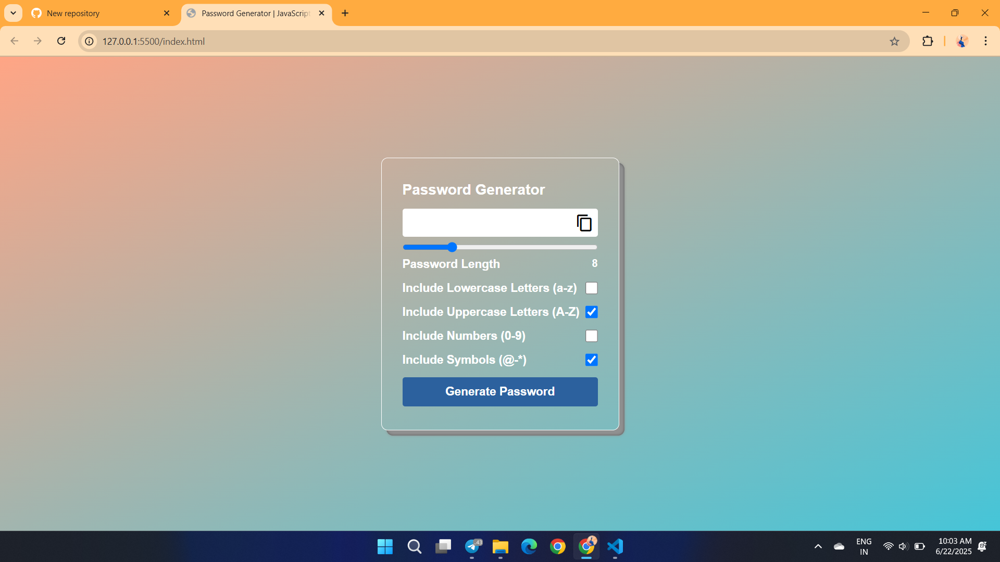
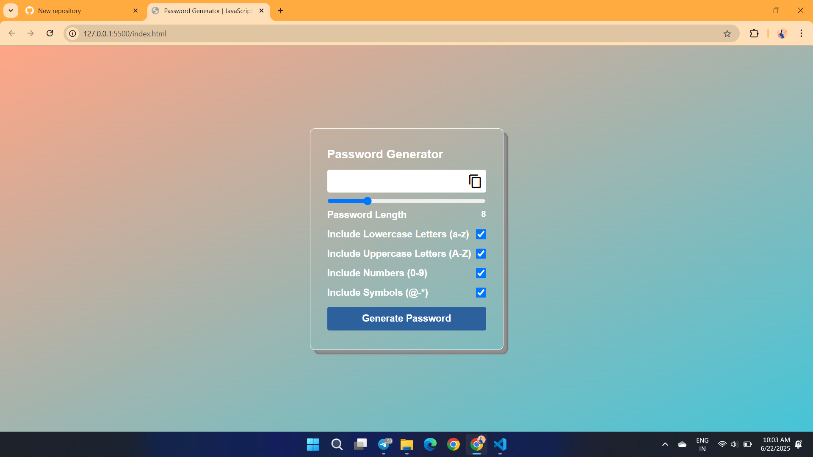

# password-generator-using-HTML-CSS-JavaScript

A **secure password-generator web application** built with **HTML5**, **CSS3**, and **Vanilla JavaScript**.  
Users can instantly create random passwords of custom length and character-set, then copy them to the clipboard — all wrapped in a soft-glassmorphism UI (see screenshots below).

---https://github.com/shantanulanjewar12/password-generator-using-HTML-CSS-JavaScript/blob/3a95f5845d803367f262bf5e7bed72913248b32a/videoRec.mp4

## 🚀 Features

- Adjustable password length (slider)
- Toggle ✔️ for  
  - Lower-case letters `a-z`  
  - Upper-case letters `A-Z`  
  - Numbers `0-9`  
  - Symbols `!@#…`
- One-click **Copy-to-Clipboard**
- Strong randomness via the browser’s `crypto.getRandomValues`
- Fully responsive, minimalist glass UI

---

## 📸 Preview

### 🖼️ Screenshot 1 – Initial Interface  

### 🖼️ Screenshot 2 – Password Generated  

---

## 🎥 Demo

[🎬 Watch the live demo](./videoRec.mp4)

---

## 📂 Project Structure
password-generator-using-HTML-CSS-JavaScript
├── index.html # Mark-up
├── style.css # Glassmorphism / responsiveness
├── script.js # Core password-generation logic
├── Screenshot1.png # UI – blank state
├── Screenshot2.png # UI – generated password
├── Screenshot3.png # UI – copied confirmation
├── demoRec.mp4 # Short walkthrough video
└── README.md # Project documentation

## 🧠 What I Learned

- Using `crypto` API for true randomness in JS
- Dynamic DOM manipulation (slider, checkboxes)
- Designing glassy / neumorphic components with pure CSS
- Clipboard API (`navigator.clipboard.writeText`)
- Modular, accessible form controls

Feel free to fork the repo, star ⭐ it if helpful

